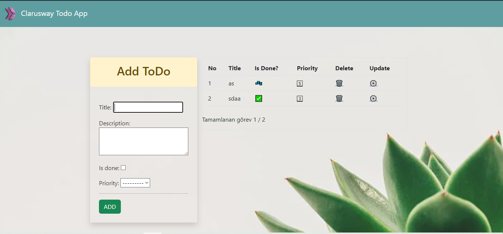

<!-- Please update value in the {}  -->

<h1 align="center">ToDo App</h1>


<div align="center">
  <h3>
    <a href="https://{your-demo-link.your-domain}">
      Demo
    </a>
     | 
    <a href="https://{your-url-to-the-solution}">
      Project
    </a>
 
  </h3>
</div>

<!-- TABLE OF CONTENTS -->

## Table of Contents

- [Table of Contents](#table-of-contents)
- [Overview](#overview)
  - [Built With](#built-with)
- [How To Use](#how-to-use)
- [Acknowledgements](#acknowledgements)
- [Contact](#contact)

<!-- OVERVIEW -->

## Overview



### Built With

<!-- This section should list any major frameworks that you built your project using. Here are a few examples.-->

- HTML
- CSS
- JS
- Django

## How To Use

<!-- This is an example, please update according to your application -->

To clone and run this application, you'll need [Git](https://git-scm.com) 
```bash
# Clone this repository
$ git clone https://github.com/huseyin-aln/11-ToDo-App-CBV

# Install dependencies
    $ python -m venv env
    > env/Scripts/activate (for win OS)
    $ source env/bin/activate (for macOs/linux OS)
    $ pip install -r requirements.txt
# Edit .backend.env to .env
# Add SECRET_KEY in .env file

# Run the app
    $ python manage.py runserver
```

## Acknowledgements
- Information for your projects

## Contact

- 
- GitHub [@huseyin-aln](https://{github.com/huseyin-aln})

- Linkedin [@Hüseyin Arslan](https://{[linkedin.com/your-username](https://www.linkedin.com/in/huseyin-arslan444/)})

